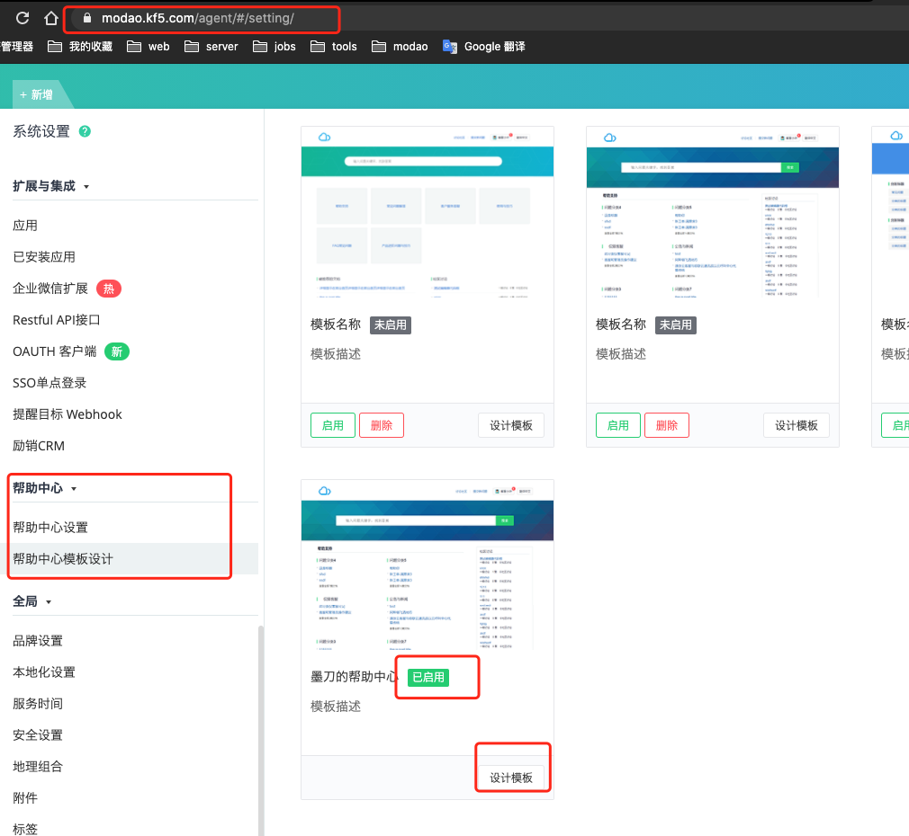
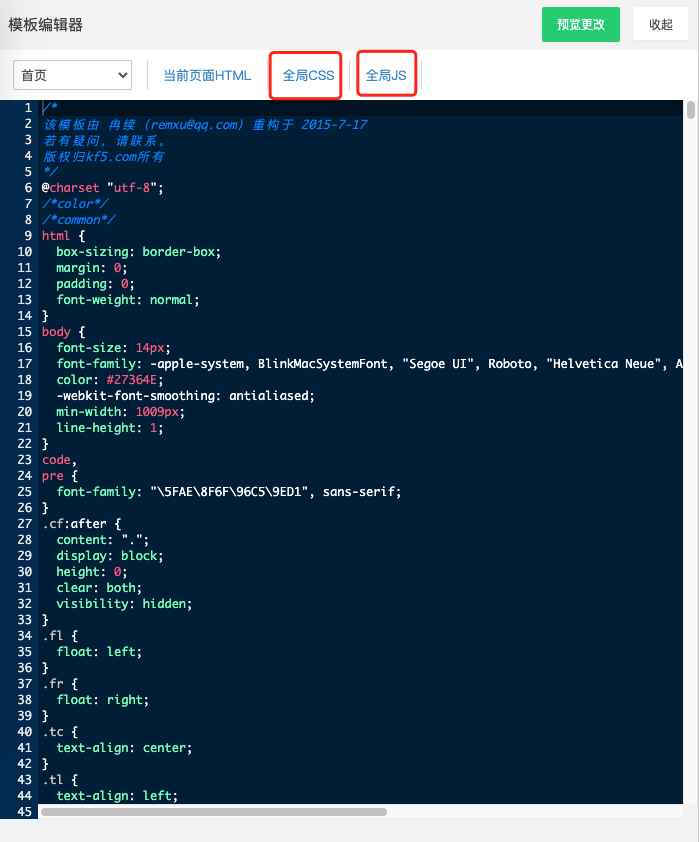
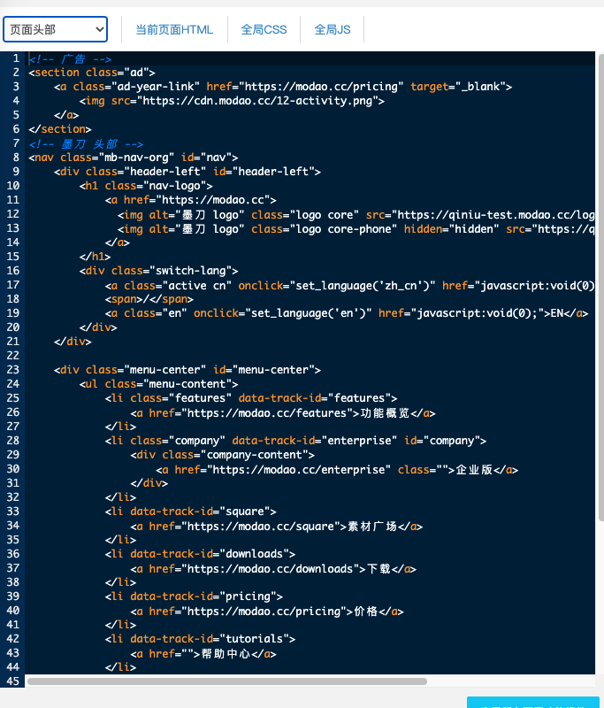
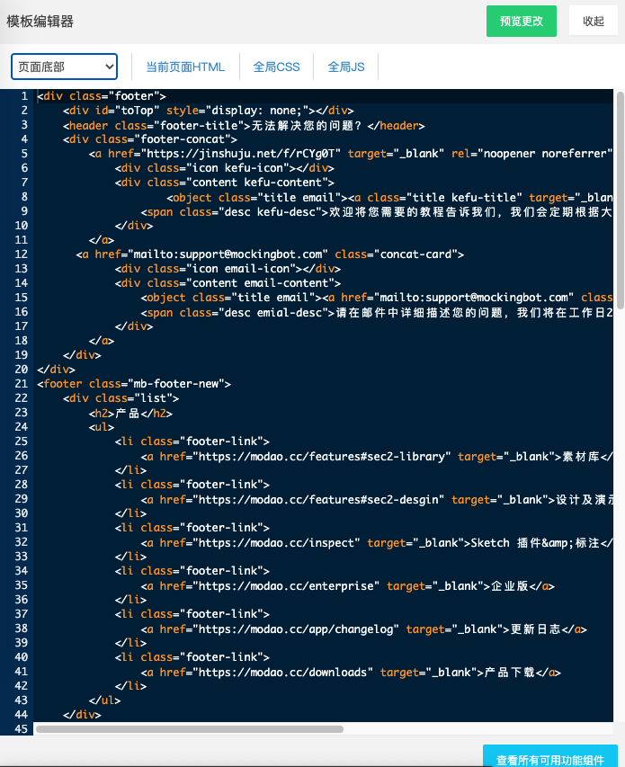

## 墨刀帮助中心
---
### 登录逸创云客服设置平台 <https://modao.kf5.com/agent/#/setting>

客服账号：```support@mockingbot.com   ```  
客服密码：```imodao2019```


找到```已启用```的模板，点击```设计模板```，进入模板编辑页

  
👆 模板编辑器可以编辑各个部分(首页，全局头部，全局底部，搜索页)的 ```HTML```可以设置全局的 ```CSS``` 和 ```JavaScript```

  
👆 在这里设置帮助中心头部的内容，相当于导航栏。

  
👆 在这里设置帮助中心底部的内容。

头部和底部的内容在各个页面都会显示。

### 本地调试
在线上编辑器里开发页面很不方便，可以将对应页面的 html 保存到本地，引入全局 css 文件 和 js，通过改变本地的全局 css 文件和 js 文件来改变 html 页面的样式和交互。开发好后将 本地的全局 css 文件和全局 js 文件直接粘贴到线上的编辑器内即可。

项目目录中的 src.js 和 theme_qing.css 和编辑器中的全局 js / css 是一致的，并引入了 hc.html（首页）。可以现在本地调试 css 和 js, 在 hc.html 中查看效果，没有问题后粘贴到线上的模板编辑器中。

